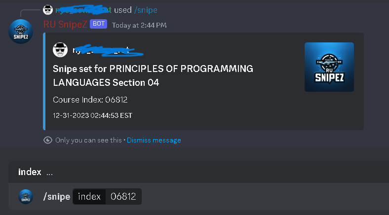
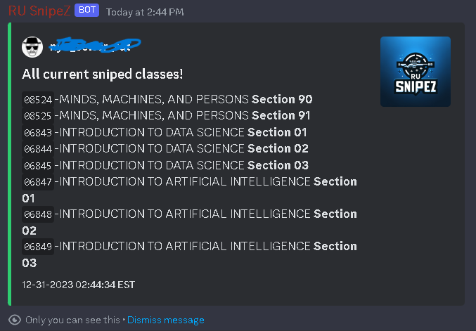
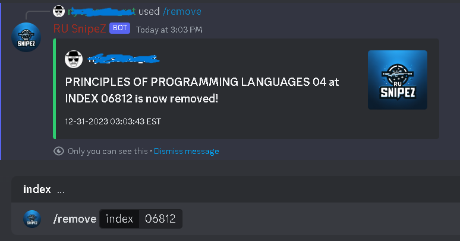
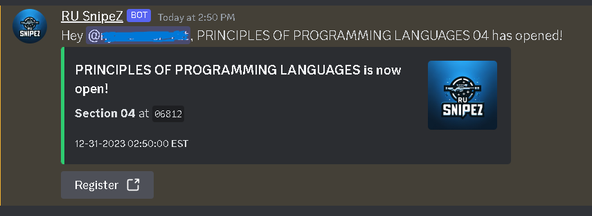

<div align="center">
  

  <h1>RU SnipeZ</h1>

  <p><strong>Automated Rutgers course section sniper powered by Discord</strong></p>

  <p>
    
    
    
    
  </p>
</div>

---

## What is RU SnipeZ?

Getting into a Rutgers course section is a race against hundreds of other students. **RU SnipeZ** removes the guesswork entirely.

It continuously monitors the **Rutgers WebReg system** and **Schedule of Classes (SoC) API**, and the moment a desired section opens, it fires a Discord notification with a **pre-filled registration link** directly to you. No copy-pasting index numbers. No fumbling around. Just click and register. It also provides insightful information such as when a course section last opened.

---

## How It Works

1. You add a course section to your personal snipe list via Discord
2. The bot watches the Rutgers SoC API in real time, tracking 25,000+ course sections by the second.
3. The instant a section opens, you receive a Discord DM with a direct WebReg registration link, index number pre-filled
4. You click, confirm, and you're in. Perfect schedule secured!

---

## Preview

**Add a course to your snipe list with `/snipe`**



**View all your currently sniped sections with `/check`**



**Remove a section from your list with `/remove`**



**Sample notification of a user's course opening**




---

## Features

- Real-time polling of the Rutgers Schedule of Classes API 
- Instant Discord DM notifications on section open (Sub-second response time)
- Pre-filled WebReg registration links to eliminate manual input by users
- Per-user snipe lists are stored persistently, tracked by Discord Unique User ID.
- Caching of course openings/closing to determine last opened status, a valuable feature Rutgers University API does not offer on its own!
- Logging of all bot commands and events, for auditability purposes.
- Semester-aware course data generation via BeautifulSoup4, Selenium, and ChromeDriver. Always have up-to-date course information.

---

## File Structure

```
ru-snipez/
├── main.py                   # Core bot logic and Discord commands
├── dataStorage.py            # User snipe list data storage
├── course_info_generation.py # Scrapes up-to-date course data per semester
├── manipulatingdata.py       # Data refresh and transformation utilities
├── last_opened.py            # Tracks when a section last became available
├── utils.py                  # Logging, timestamps, and shared helpers
├── user_data.json            # Per-user snipe lists (auto-generated)
├── ru_snipez_logs.json       # Command and event logs (auto-generated)
└── requirements.txt          # Python dependencies
```

---

## Requirements

- Python 3.10 or later
- A Discord bot token from the [Discord Developer Portal](https://discord.com/developers/applications)
- ChromeDriver (latest, matching your Chrome version) — only needed to regenerate course data for a new semester

---

## Setup

**1. Clone the repository**

```bash
git clone https://github.com/yourusername/ru-snipez.git
cd ru-snipez
```

**2. Install dependencies**

```bash
pip install -r requirements.txt
```

**3. Configure your bot token**

Create a `.env` file in the root directory:

```env
DISCORD_TOKEN=your_discord_bot_token_here
```

**4. Generate course data for the current semester**

Make sure ChromeDriver is installed and accessible, then run:

```bash
python course_info_generation.py
```

**5. Start the bot**

```bash
python main.py
```

---

## Usage

Once the bot is running in your Discord server, use the available commands to manage your snipe list. When a section opens, you will receive a direct message with a registration link ready to go.

---

## Disclaimer

RU SnipeZ is an independent project and is not affiliated with, endorsed by, or officially connected to Rutgers University. Use responsibly and in accordance with Rutgers University's academic policies.

---

## Contributing

Pull requests are welcome. For major changes, please open an issue first to discuss what you would like to change.

---

<div align="center">
  Made for Rutgers students, by a Rutgers student
</div>
