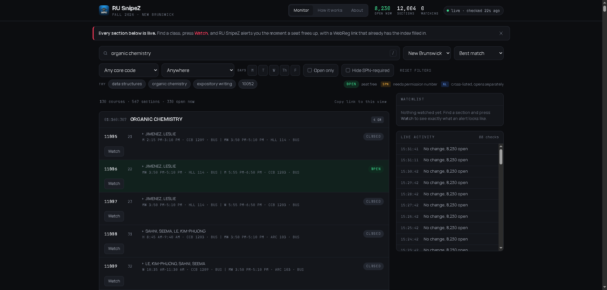
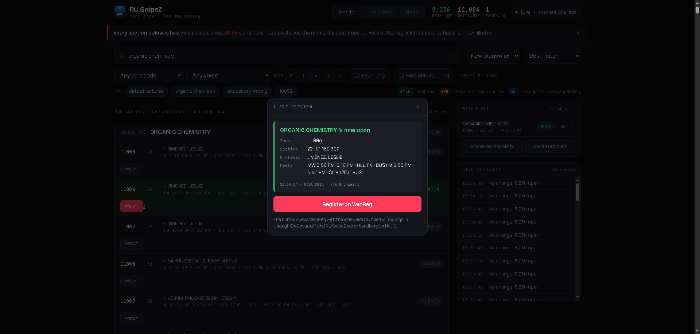
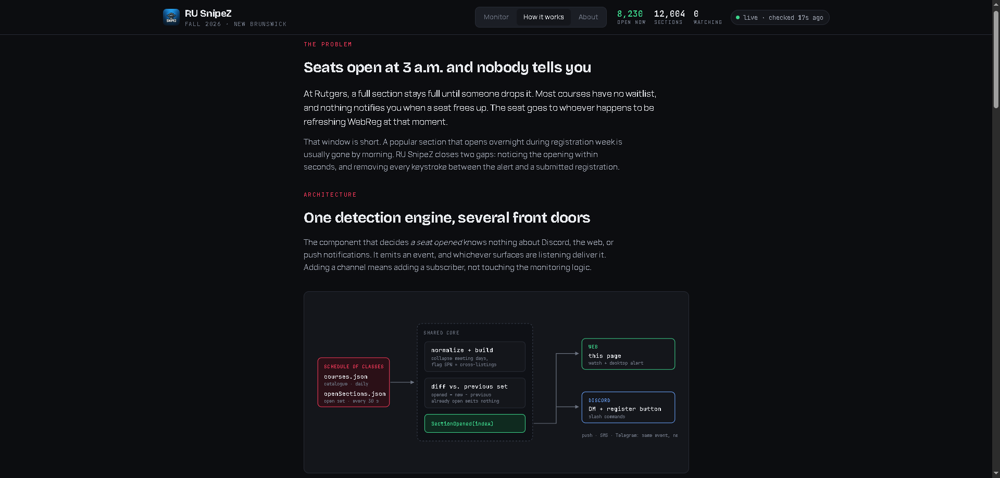
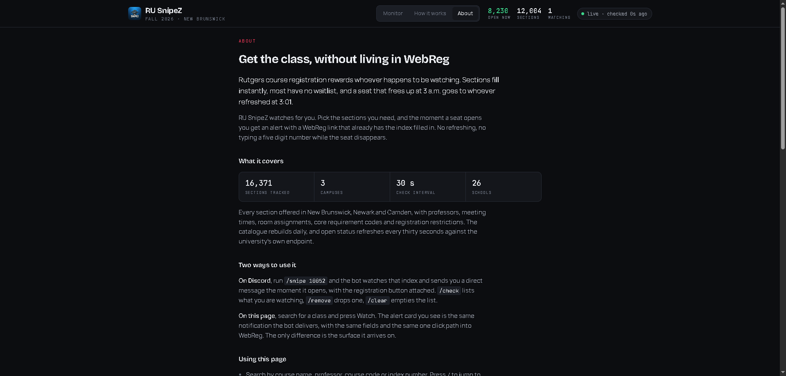

<div align="center">
  
  <h1>RU SnipeZ</h1>
  <p><strong>Live open-seat monitor for Rutgers course registration.</strong><br>
  Search 16,371 sections across all three campuses, watch the ones you need, and get a WebReg link with the index already filled in the second a seat opens.</p>
  <p>
    <a href="https://ru-snipez.vercel.app"><strong>ru-snipez.vercel.app</strong></a>
  </p>
  <p>
    
    
    
  </p>
</div>

---

## The problem

Rutgers course registration rewards whoever happens to be watching. Sections fill in the first hour of enrollment, most have no waitlist, and when a spot opens back up, it goes to whoever refreshes WebReg at exactly the right second. During registration week that means checking a five digit index number by hand, over and over, sometimes at three in the morning, for days.

I was doing that for my own schedule and it was obviously a problem a computer should solve. Rutgers already publishes which sections are open, as an unauthenticated JSON endpoint anyone can call. Nobody was watching it for me. So I built something that would.

## What I built

**RU SnipeZ is a Discord bot that watches course sections and messages you the moment a seat opens.** You give it an index, it polls the registrar, and when your section frees up you get a direct message with a button that opens WebReg with the index already typed in. It shipped to a real Discord community and people used it to get into classes.

<p align="center">
  
  
</p>

`/snipe 10052` starts watching an index. `/check` lists what you're watching, `/remove` drops one, `/clear` empties the list. That's the whole interface, because the whole point is to need it as little as possible.

## Why there's also a website

A Discord bot is a bad thing to put in front of someone who isn't already in your server. So I pulled the detection logic out of the bot and gave it a second front end: a live site anyone can open and try immediately, no account, no server invite.

**[ru-snipez.vercel.app](https://ru-snipez.vercel.app)** is that site, and it runs on real data. Search the catalogue, press **Watch**, and the alert that renders is the same one the bot sends, with the same fields and the same link into WebReg.

<p align="center">
  
</p>

<p align="center">
  
  
</p>

Filter by meeting day, campus location or core requirement code, sort by open seats or best match, and share any search as a URL. Click a section to expand it into exam date, prerequisites, the full meeting pattern and a copyable index.

<p align="center">
  
</p>

## How the detection actually works

The endpoint Rutgers exposes, `openSections.json`, returns a flat array of every currently open index. The naive approach is to check that array on a timer and fire a notification whenever your section appears in it, which means firing again on the next check, and the one after that, for as long as the seat stays open. V1 solved that with a ten minute cooldown per user, tracked in memory, which meant a bot restart during registration week could re-notify everyone whose sections happened to be open at that moment.

The actual fix was to stop asking a yes or no question and start computing a difference instead. Every cycle keeps the previous open set, subtracts it from the new one, and only what's left over is news:

```
                    ┌─ courses.json  (daily)  ──► catalogue build ──► static file on a CDN
Schedule of Classes ┤
                    └─ openSections.json (30s) ──► edge proxy ──► new − previous = what actually changed
                                                                         │
                                                          only this ─────┴──► alert + pre-filled WebReg link
```

A section that was already open is not in that difference, so it produces no event and needs no cooldown to suppress. The correctness comes from the shape of the computation, not from a rule bolted on to patch a symptom.

The 30 second interval isn't arbitrary either. Rutgers' own response declares `Cache-Control: max-age=30`, meaning any cache between here and the registrar might already be serving something up to 30 seconds old. Polling faster than that can't surface anything sooner, it just makes more requests that cannot possibly contain news. Matching the interval to what the server actually promises keeps detection at its real floor.

## What building this actually surfaced

Rutgers doesn't publish documentation for these endpoints. Everything below came from reading real responses, and each one changed something in the design.

**Two endpoints ignore the parameters they accept.** `courses.json` takes a `subject` filter and returns the entire campus catalogue regardless, which is good news since it means the whole catalogue is one request instead of one per department. `openSections.json` takes a `campus` filter and does the same thing in reverse: it returns every open section university-wide no matter which campus you ask for. That one cost real correctness until I caught it, because the demo's headline "sections open" counter was reading 11,444 on the Camden page, which is New Brunswick's number, not Camden's. Fixed by intersecting the response against the catalogue actually loaded for that campus, since that's the only list that knows what belongs where.

**Index numbers get reused across terms.** 3,059 index numbers valid in one recent term are also valid in a different term entirely, attached to unrelated courses. An index by itself is not a stable identifier for anything you plan to remember past the current semester, so every stored record here is keyed by term and campus, not by index alone.

**Cross-listed sections have separate seat pools.** A class taught once but listed under two departments gets two index numbers, and they open and close independently. Right now 254 of the 970 cross-listed pairs in the Fall catalogue are in a split state, one side open and the other closed. Watching only one side misses half the chance, so the alert offers to add the other index the moment you watch either one.

**A quarter of sections aren't actually registrable when they open.** 2,902 of 12,004 New Brunswick sections carry a special permission requirement, meaning an open seat still needs department sign-off before you can add it. Those get flagged distinctly rather than announced the same way as a normal opening, because treating them identically would be actively misleading.

**Course titles are written in a shorthand nobody types.** Expository Writing exists in the catalogue as `COLLEGE WRITING`. Chemistry courses show up as `ADV ORGANIC CHEM I`. A search box that only does exact substring matching returns nothing for the name a student actually knows, so search here scores tokens independently across title, code, instructor and subject, expands common abbreviations before matching, and ranks by relevance instead of requiring every word to hit.

| Someone searches for | And actually finds |
|---|---|
| `expository writing` | `01:355:101` COLLEGE WRITING |
| `microbiology health science` | `01:119:131` MICROBIOL HLTH SCI |
| `intro to computer science` | `01:198:111` INTRO COMPUTER SCI |
| `10052` | `01:013:120` LITERARY EGYPT |

## Where the product stops on purpose

The obvious next feature is automatic registration: skip the alert, skip the click, just enroll the student the second the seat opens. That requires holding a Rutgers NetID and password for every user, which turns a small utility into custody of thousands of university logins. That's a liability no convenience justifies, and it's also very likely the fastest way to get a project like this shut down by the university it depends on.

So the boundary is fixed: RU SnipeZ detects the opening and delivers the alert with the index already filled in. The student clicks through and signs in to WebReg through CAS themselves, exactly as they always would. It costs a few seconds. It also means there is no credential store here to secure, to breach, or to be trusted with in the first place.

## How it's built

One detection core, two delivery surfaces:

```
src/rusnipez/soc/      term encoding, async API client, payload normalizer
src/rusnipez/catalog/  catalogue builder, run daily by CI across all three campuses
web/                   the site itself: static HTML/CSS/JS, no framework, no build step
lib/soc-proxy.js       the proxy logic, written once against the standard Request/Response
api/                   Vercel edge functions wrapping lib/soc-proxy.js
worker/                the same proxy as a standalone Cloudflare Worker, for other hosts
scripts/devserver.py   a local server that mirrors production so development needs no cloud account
tests/                 43 tests over the normalizer and the term encoding
legacy/v1/             the original bot, kept for reference
```

The frontend has no framework because it doesn't need one: the entire application is a filtered render over one in-memory array and a set difference computed every 30 seconds. Course data (titles, professors, meeting times, roughly 4.8 MB) barely changes during a term, so it's built once a day and served as a static file from a CDN. Only the open/closed status is actually live, and that response is small enough to diff in memory in about 2 milliseconds. Nothing here needed a database, because nothing here needed to remember anything past the current page load, yet.

The proxy exists because Rutgers sends no CORS headers on either endpoint, so a browser can't call them directly. It's one function, written against the web platform's own `Request` and `Response` types rather than a specific host's SDK, which is why the exact same code runs as a Vercel edge function and as a Cloudflare Worker without being written twice.

## Try it yourself

```bash
git clone https://github.com/dpat0103/RUSnipeZ.git
cd RUSnipeZ
pip install -e ".[dev]"
python -m rusnipez.catalog.build --term 92026 --campus NB
python scripts/devserver.py
```

Then open `http://localhost:8788`. The dev server mirrors the production `/api` routes locally, so you're developing against live Rutgers data without needing a Vercel or Cloudflare account.

```bash
pytest -q
ruff check src tests && ruff format --check src tests
```

CI runs the same lint, test and dependency audit on every push, and a second scheduled workflow rebuilds the catalogue daily and refuses to publish one that looks truncated.

## Deploying your own copy

The site is static files plus one small serverless function, and the function is the part that can't be skipped: without a proxy in front of the Rutgers endpoints, a browser gets blocked by CORS before it ever sees live data.

**Vercel:** run `npx vercel --prod`. `vercel.json` points it at `web/` and it picks up `api/open.js` and `api/courses.js` as edge functions with no extra configuration. This is what's actually running at [ru-snipez.vercel.app](https://ru-snipez.vercel.app).

**Cloudflare Pages:** run `npx wrangler pages deploy web --project-name ru-snipez`. `web/functions/api/` runs as Pages Functions on the same origin as the site.

**A purely static host,** since GitHub Pages and similar can't run either of the above, needs the proxy deployed [`worker/`](worker/) on its own and point the page at it with `<meta name="api-base" content="https://your-worker.workers.dev">`. Search and the catalogue still work without the proxy; live open and closed status does not.

## What's next

The site currently detects openings only while a tab is open, because the browser itself is doing the 30 second polling. The Discord bot doesn't share that limitation, since it runs as a standing process. Closing that gap for the web surface means moving detection to an always-on process and adding **Web Push** as the first channel that reaches you with nothing open at all.

After that: a proper per-term history of when sections last opened, a nudge to watch both sides of a cross-listed pair automatically, and letting a student watch a **core requirement** instead of an index, so they can ask for any open section that satisfies their remaining Historical Analysis credit without knowing in advance which course they want.

## License

[MIT](LICENSE)
