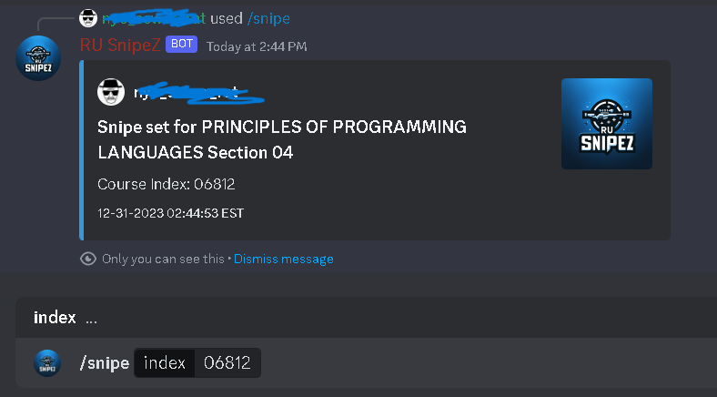
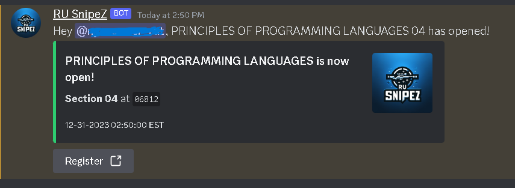

<div align="center">
  
  <h1>RU SnipeZ</h1>
  <p><strong>Live open-seat monitor for Rutgers course sections.</strong><br>
  Search 16,371 sections across all three campuses, see what's open right now, and get a WebReg link with the index already filled in.</p>
  <p>
    
    
    
  </p>
</div>

---

> **Live site:** not deployed yet. One command gets you there, see [Deploy](#deploy).

## What it does

Rutgers publishes an unauthenticated list of currently-open section indexes, and WebReg accepts a registration index pre-filled in the URL. The entire value of this project is closing the gap between *"a seat opened"* and *"you have a registration form loaded."*

```
                    ┌─ courses.json (930 KB, daily) ──► CI build ──► static catalogue (CDN)
Schedule of Classes ┤
                    └─ openSections.json (26 KB, live) ──► edge proxy (30 s cache) ──► diff vs. previous set
                                                                                            │
                                                                         newly opened ──────┴──► alert + WebReg link
```

Detection is **edge-triggered**: each cycle computes `new - previous`, so a section that was already open produces no event. Correctness comes from the shape of the computation rather than from suppression rules layered on top of it.

## Two surfaces, one engine

The component that detects an opening knows nothing about how you get told. It
emits an event and whichever surfaces are listening deliver it.

**Discord.** `/snipe 10052` starts watching an index. When the seat frees up the
alert arrives as a direct message with the register button attached.

<p align="center">
  
  
</p>

`/check` lists everything you are watching, `/remove` drops one, `/clear` empties
the list.

**Web.** Search the catalogue, press Watch, and the same alert renders in the
browser with the same fields and the same one click path into WebReg. Filter by
meeting day, campus location or core requirement, and share any view as a URL.

## Why the data is split

| Data | Where it lives | Refresh |
|---|---|---|
| Catalogue: titles, professors, meeting times, 4.8 MB | **Stored** as static JSON on a CDN | Rebuilt daily by CI |
| Open/closed status, 26 KB | **Polled** through the edge proxy | Every 30 s, edge-cached |

The page does not re-download 4.8 MB every thirty seconds. It fetches a small array of index numbers and diffs it in memory: **27 ms** to parse the catalogue once, **2 ms** per diff across 11,444 indexes. That measurement is why this surface needs no database.

## Findings on the undocumented API

Rutgers publishes no API documentation. These were established by inspection, and each one changed a design decision.

- **Index numbers are recycled between terms.** 3,059 index numbers valid in one recent term are also valid in another, attached to entirely different courses. An index alone is not a stable identifier, so every stored record is keyed by `(term, campus, index)`.
- **Cross-listed sections open independently.** Of 970 cross-listed pairs in Fall 2026, **254 are currently split**: one index open, its twin closed. Watching one does not cover the other, so the alert offers to add both.
- **24% of sections require a special permission number** (2,902 of 12,004 in New Brunswick). An open seat there isn't registrable without departmental approval, so they're badged rather than treated as a normal opening.
- **No CORS headers**, so a browser cannot call the endpoints directly, which is why the proxy exists. **`Cache-Control: max-age=30`** sets the floor on useful polling. An `ETag` is sent but `If-None-Match` is ignored, so conditional requests save nothing.
- **`courses.json` ignores its own `subject` parameter**, returning the entire campus catalogue from one request.
- **Two endpoints ignore parameters they accept.** `courses.json` takes a `subject` and returns the whole campus regardless; `openSections.json` takes a `campus` and returns every open index university wide, all 11,444 of them, whichever campus you ask for. Campus scoping therefore happens against the loaded catalogue, which is the only authoritative statement of what belongs where.
- **Titles are aggressively abbreviated.** Expository Writing is filed as `COLLEGE WRITING`; you'll also find `MICROBIOL HLTH SCI`. Exact matching returns nothing for the names students type, so search is relevance-ranked instead.

## Search

Tokens are scored independently across index, code, title, instructor and subject; abbreviations are expanded into the searchable text; stopwords are dropped; ties break toward courses offering more sections.

| Query | Top result |
|---|---|
| `expository writing` | `01:355:101` COLLEGE WRITING (109 sections) |
| `microbiology health science` | `01:119:131` MICROBIOL HLTH SCI |
| `intro to computer science` | `01:198:111` INTRO COMPUTER SCI (63 sections) |
| `10052` | `01:013:120` LITERARY EGYPT |

Dropping stopwords mattered more than it looks: before that, `intro to computer science` ranked *Introduction to Data Science* first, purely on the word "to".

## Run it locally

```bash
pip install -e ".[dev]"
```

```bash
python -m rusnipez.catalog.build --term 92026 --campus NB
```

```bash
python scripts/devserver.py
```

Then open <http://localhost:8788>. The dev server serves `web/` and mirrors the production `/api` routes, so no Cloudflare account is needed to develop against live Rutgers data.

## Deploy

The site is static files plus one serverless function. The function is not
optional: the Rutgers endpoints send no CORS headers, so without a proxy the
browser cannot fetch live status at all. Any host that runs edge functions
works, and adapters for two are included.

### Vercel

```bash
npx vercel --prod
```

`vercel.json` serves `web/` as the static root and Vercel picks up `api/open.js`
and `api/courses.js` as edge functions automatically. Nothing else to configure.
The Hobby tier is free and covers this comfortably.

### Cloudflare Pages

```bash
npx wrangler pages deploy web --project-name ru-snipez
```

`web/functions/api/` runs as Pages Functions on the same origin. The free tier
covers 100,000 function requests per day, and because responses are cached 30
seconds at the edge, visitor count does not translate into upstream load.

### A purely static host

GitHub Pages and similar cannot run the proxy. To use one, deploy the
standalone Worker in [`worker/`](worker/) separately and point the page at it:

```html
<meta name="api-base" content="https://ru-snipez-api.YOUR-SUBDOMAIN.workers.dev">
```

Search, filtering and the catalogue work without the proxy; live open and
closed status does not.

## Layout

```
src/rusnipez/soc/      term encoding, async API client, payload normalizer
src/rusnipez/catalog/  catalogue builder CLI
web/                   the site: static frontend + Cloudflare Pages Functions
lib/soc-proxy.js       shared proxy logic, web-standard Request and Response
api/                   Vercel edge adapters over lib/soc-proxy.js
worker/                standalone Cloudflare Worker, for static hosts
scripts/devserver.py   local server mirroring the production /api contract
tests/                 43 tests over the normalizer and term encoding
legacy/v1/             the original Discord bot, archived for reference
```

## Development

```bash
pytest -q
```

```bash
ruff check src tests && ruff format --check src tests
```

CI runs ruff, pytest and `pip-audit` on every push. A second workflow rebuilds the catalogue daily across all three campuses and refuses to publish a truncated one.

## Roadmap

Live: catalogue pipeline, API client, normalizer, edge proxy, web surface, Discord surface.

Next, in order:

1. **Always-on polling engine** so web alerts fire with the tab closed. The browser currently does the polling, which means the web surface watches only while it is open.
2. **Web Push** as the first background channel, free and requiring no account.
3. **Persistent last-opened history**, which needs the poller above plus a per-term store, for the reason in the findings section.
4. **Watching by core requirement**, so a student can ask for any open section satisfying a remaining Historical Analysis credit without knowing which course they want. This inverts the product: you stop needing to know the index in advance.
5. **Telegram and SMS channels**, for students who do not use Discord.

## Scope

RU SnipeZ **notifies**. It does not register on your behalf, and it never asks for, stores or transmits a NetID or password. You authenticate to WebReg through CAS yourself, and the link only saves you from typing the index. That boundary is deliberate: automating registration would mean holding university credentials for thousands of students, which is a liability no convenience justifies.

## License

[MIT](LICENSE)
